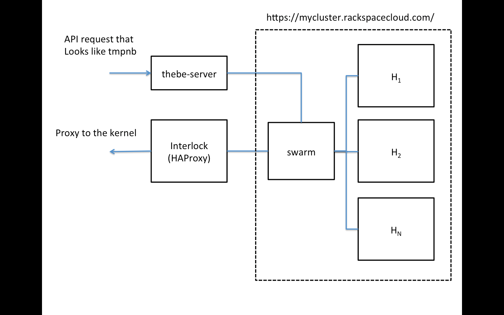

# thebe-server

Goal is to create a system that we can use to scale the thebe backends.  The idea is to:

* Mimic the tmpnb API for spawning an image, except that we can also spawn a specific container
* Use docker swarm as a backend; in this case, we'll also use Rackspace's hosting service
* Use interlock (https://github.com/ehazlett/interlock) to handle service discovery to the Docker containers

The following diagram summarizes the architecture:



## Thebe Server

### thebe-launcher.go

This is the basic service that will launch the containers.  It should:

* Accept the image name to start
* Use the Docker (swarm?) API to launch the instance with sensible defaults

### thebe-destroyer.go

A background service that culls unused containers.


## Docker Swarm

All the docker containers are launched and managed by swarm.  We'll use the Rackspace offering for this as a host (https://mycluster.rackspacecloud.com/)


```
docker run -d           \
   -p 8888:8888          \
   ipython/scipystack    \
   ipython notebook --ip=0.0.0.0 --no-browser
```

## Interlock

Interlock (https://github.com/ehazlett/interlock) will monitor the swarm cluster and set up the required proxies
