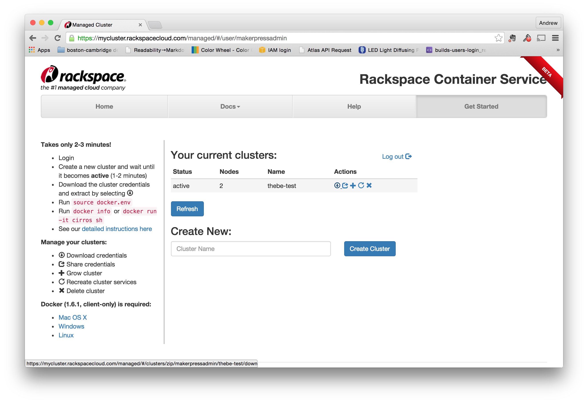

# Create a rackspace cluster

Once you've got the two servers set up, you're ready to create a swarm cluster.  First, log into the [rackspace cluster manager](https://mycluster.rackspacecloud.com/).  
From the main page, create a new cluster (right now there's only 1 button to push).  I've named mine `thebe-test`:



Once you've got the cluster running, you'll need to download the credentials file by clicking the "Download credentials" link in the "Action" area.  (It looks like a circle with an arrow pointing down.)

When you unzip it, you'll see a new
directory whose name looks like a UUID or a swarm id.  

```
$ unzip thebe-test.zip
Archive:  thebe-test.zip
   creating: e1c3155e-a0f2-4e8b-acb8-de123e8dd3c6/
  inflating: e1c3155e-a0f2-4e8b-acb8-de123e8dd3c6/ca.pem  
  inflating: e1c3155e-a0f2-4e8b-acb8-de123e8dd3c6/README.md  
  inflating: e1c3155e-a0f2-4e8b-acb8-de123e8dd3c6/ca-key.pem  
  inflating: e1c3155e-a0f2-4e8b-acb8-de123e8dd3c6/docker.env  
  inflating: e1c3155e-a0f2-4e8b-acb8-de123e8dd3c6/cert.pem  
  inflating: e1c3155e-a0f2-4e8b-acb8-de123e8dd3c6/key.pem  
$ cd e1c3155e-a0f2-4e8b-acb8-de123e8dd3c6/
$ ls -la
total 48
drwxr-xr-x@  8 apple  staff   272 Aug 28 10:36 .
drwx------+ 56 apple  staff  1904 Sep  1 14:50 ..
-rw-r--r--@  1 apple  staff  3177 Aug 28 10:36 README.md
-rw-r--r--@  1 apple  staff  1766 Aug 28 10:35 ca-key.pem
-rw-r--r--@  1 apple  staff  1119 Aug 28 10:35 ca.pem
-rw-r--r--@  1 apple  staff  1086 Aug 28 10:35 cert.pem
-rw-r--r--@  1 apple  staff   153 Aug 28 10:36 docker.env
-rw-r--r--@  1 apple  staff  1679 Aug 28 10:35 key.pem
$
```

You'll see the following files inside this new directory:

* README.md - a set of instructions with how to use the credentials
* ca.pem - Certificate Authority, used by clients to validate servers
* cert.pem - Client Certificate, used by clients to identify themselves to servers
* key.pem - Client Private Key, used by clients to encrypt their requests
* ca-key.pem - Certificate Authority Key, private file used to generate more client certificates.
* docker.env - Shell environment config file


## Using `rackspace-swarm-test`

If you don't have Docker 1.6 installed on your local host machine, you can also run it from the `rackspace-swarm-test` server you created earlier.  

Once you've downloaded the credentials, just `scp` the file over, like this:

```
scp your-credential-file.zip root@rackspace-swarm-test:.
```

Once it's copied, login to the server, unzip it, and then you're good to go.


### Set up the docker environment

Run the `docker.env` file inside your new directory in order to set your credentials so that you can access the swarm:

```
$ cd e1c3155e-a0f2-4e8b-acb8-de123e8dd3c6/
$ source docker.env
```


You can use `docker info` to see the setup:

```
# docker info
Containers: 12
Images: 8
Storage Driver:
Role: primary
Strategy: spread
Filters: affinity, health, constraint, port, dependency
Nodes: 2
 e1c3155e-a0f2-4e8b-acb8-de123e8dd3c6-n1: 104.130.0.51:42376
  └ Containers: 6
  └ Reserved CPUs: 0 / 12
  └ Reserved Memory: 0 B / 2.1 GiB
  └ Labels: executiondriver=native-0.2, kernelversion=3.12.36-2-rackos, operatingsystem=Debian GNU/Linux 7 (wheezy) (containerized), storagedriver=aufs
 e1c3155e-a0f2-4e8b-acb8-de123e8dd3c6-n2: 104.130.0.52:42376
  └ Containers: 6
  └ Reserved CPUs: 0 / 12
  └ Reserved Memory: 0 B / 2.1 GiB
  └ Labels: executiondriver=native-0.2, kernelversion=3.12.36-2-rackos, operatingsystem=Debian GNU/Linux 7 (wheezy) (containerized), storagedriver=aufs
Execution Driver:
Kernel Version:
Operating System:
CPUs: 24
Total Memory: 4.2 GiB
Name: cbf73ed2e215
ID:
Http Proxy:
Https Proxy:
No Proxy:
```

# Using the Swarm

Once you get all the credentials set up, using the swarm looks a lot like using regular old docker, except now everything is running on a cluster.  

For example, here's how you start a notebook on the swarm

```
docker run -d            \
   -p 8888               \
   ipython/scipystack    \
   /bin/sh -c 'ipython notebook --ip=0.0.0.0 --no-browser'
```

To see the status, do a `docker ps`

```
# docker ps
CONTAINER ID        IMAGE                       COMMAND                CREATED             STATUS              PORTS                          NAMES
e13c8fdc2ce8        ipython/scipystack:latest   "/bin/sh -c 'ipython   4 seconds ago       Up 5 seconds        104.130.0.51:49153->8888/tcp   e1c3155e-a0f2-4e8b-acb8-de123e8dd3c6-n1/dreamy_elion  
```

From the output, you can see that the notebook server is running at `104.130.0.51:49153`.  Opening this in the browser will let you use the web UI.
