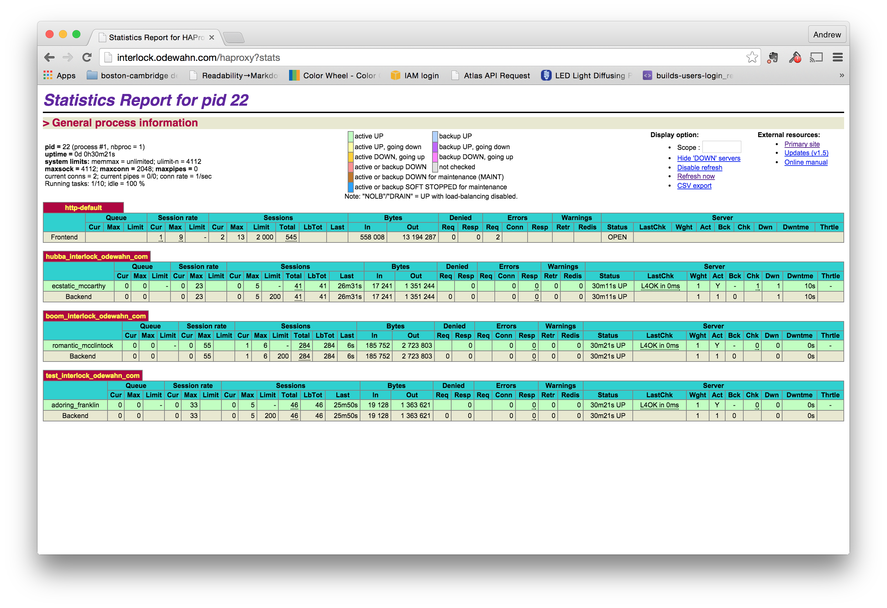
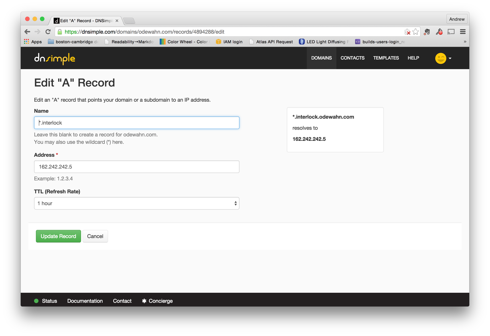

# Service discovery with interlock (HAProxy plugin)

[Interlock](https://github.com/ehazlett/interlock) is a plugin-service for Docker.  Its [HAProxy](https://github.com/ehazlett/interlock/tree/master/plugins/haproxy) plugin "adds an event driven load balancer and reverse proxy for Docker. It automatically adds containers that are running in a Swarm to HAProxy."  

It provides a really simple way to do service discovery for swarm.

## Starting Interlock

You must provide the HAProxy plugin with the following values, which can all be found in the `credentials` file for your cluster:

* --swarm-url: url to swarm (default: tcp://127.0.0.1:2375)
* --swarm-tls-ca-cert: TLS CA certificate to use with swarm (optional)
* --swarm-tls-cert: TLS certificate to use with swarm (optional)
* --swarm-tls-key: TLS certificate key to use with swarm (optional)


First, you need to figure out where your swarm is running.  To do this, run the following command on the machine where you're controlling the swarm (i.e., the place where you ran the `source docker.env` command):

```
# cat bea81d17-0f6a-40af-affe-5846a528e574/docker.env | grep HOST
export DOCKER_HOST=tcp://104.130.0.52:2376
```

Next, start the interlock service on the proxy host.  (Be sure to download and unzip your swarm's credentials first.)  We'll also set to environment variables just to hold some of the key info about the credentials:

```
export CREDS_DIR=/root/9fadfa89-0400-453a-a7eb-436aea737831
export SWARM_URL=tcp://104.130.0.52:2376

docker run -d -p 80:80 -v $CREDS_DIR:/certs ehazlett/interlock \
   --swarm-url         $SWARM_URL \
   --swarm-tls-ca-cert /certs/ca.pem \
   --swarm-tls-cert    /certs/cert.pem \
   --swarm-tls-key     /certs/key.pem \
   --debug \
   --plugin haproxy start
```

## Start some containers on the swarm controller

Once it's running, interlock will automatically handle proxying for new containers in the swarm.  

So, go back to your swarm host and start csome containers.  All you need to do is provide a few additional options to the docker command to publish the ports and specify the hostname:

```
docker run -d  \
   -p 8888 \
   -P \
   --hostname hubba.interlock.odewahn.com \
   ipython/scipystack    \
   /bin/sh -c 'ipython notebook --ip=0.0.0.0 --no-browser'
```

## View the HAProxy status

HAProxy has a neat little web-based monitoring tool that you can use to see the running containers.  Just go to your interlock host and use the path `/haproxy?stats`.  The username is `stats` and the password is `interlock` (note that you can override this per the instruction on the [HAProxy plugin page](https://github.com/ehazlett/interlock/tree/master/plugins/haproxy)).



You can watch the monitor ro see the new endpoints as you add or remove containers.

## Enable wildcard DNS for the interlock server

Finally, make sure that you have enabled wildcard DNS on the domain where interlock is running (i.e., so that you can have a domain like `*.interlock.odewahn.com`):



Once you enable this, you'll be able to access your container using the hostame you provided.
